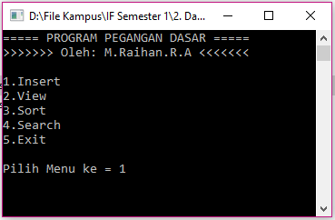

# Program Pegangan Dasar

:one: Tentang
-------------
* Nama Aplikasi : Program Pegangan Dasar
* Mata Kuliah : Dasar Algoritma dan Pemrograman (DAP)
* Bahasa Pemrograman : PASCAL
* Platform : Desktop
* Kontribusi Saya : Menyeluruh

:two: Deskripsi
---------------
Aplikasi ini bertujuan untuk pengenalan perintah dasar insert, view, sort, search, update, delete.

:three: Fitur
-------------
Aplikasi meliputi penggunaan :
- [x] Label & Constant
- [x] Array & Tipe data bentukan
- [x] Proses Insert (Mengisi Nilai)
- [x] Proses View (Menampilkan Nilai)
- [x] Proses Sort (Mengurutkan Nilai)
- [x] Proses Search (Mencari Nilai)
- [x] Proses Update (Mengedit Nilai)
- [x] Proses Delete (Menghapus Nilai)

:four: Screenshoot
------------------

